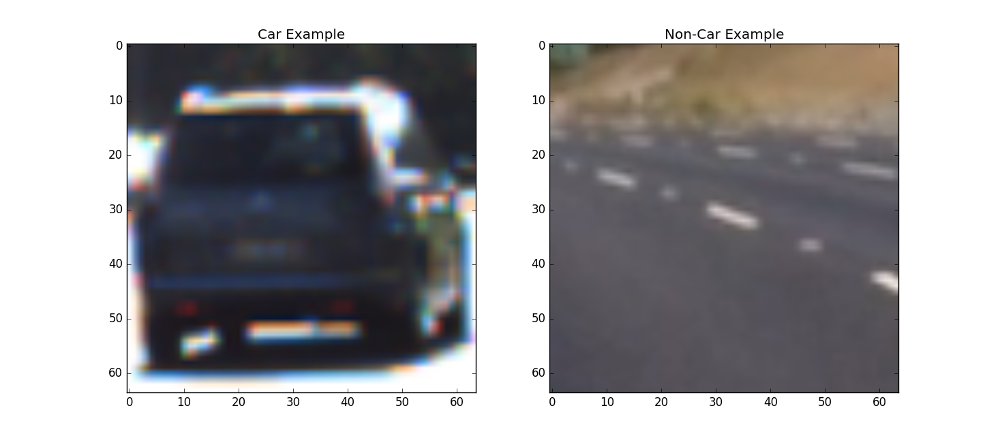
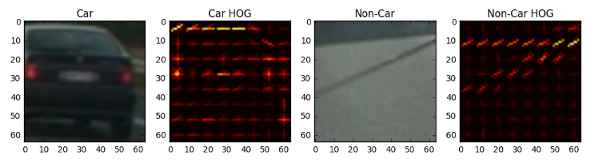
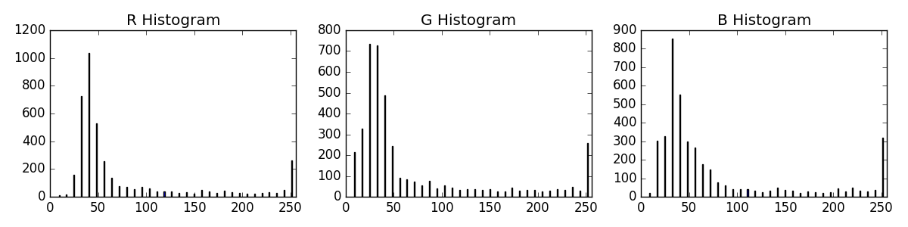
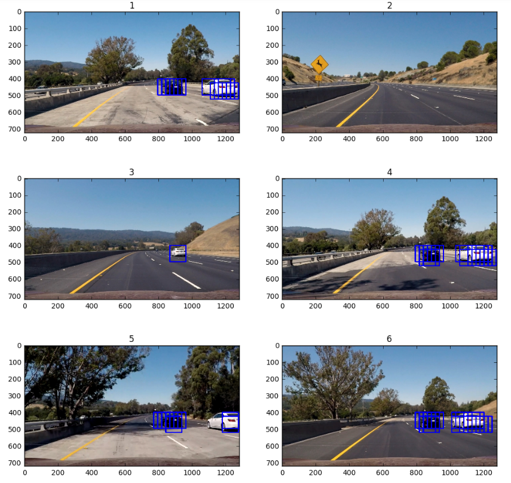
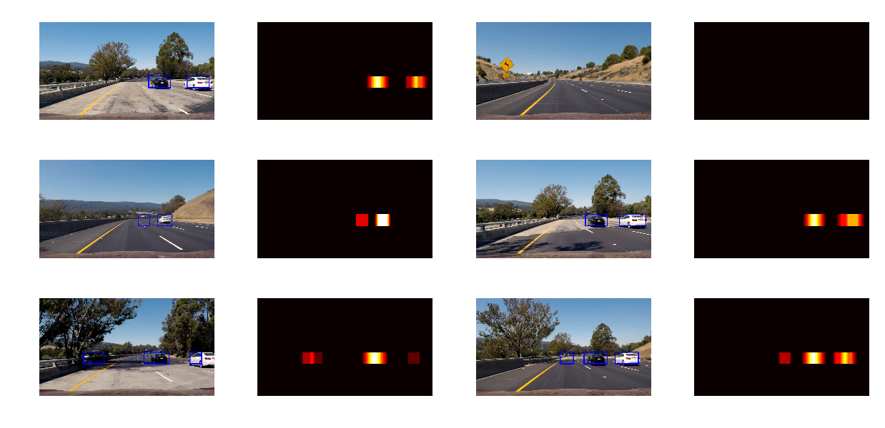
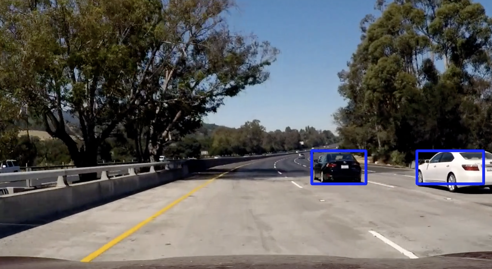

# CarND Project 5 - Vehicle Detection and Tracking

## Problem Statement

The goal of this project is to design a software pipeline which identifies and tracks vehicles in a video stream from a front-facing car camera.

## Approach

The pipeline is composed of the following steps:

* Combine the method of Histogram of Oriented Gradients (HOG) with binned color features and histogram of color to extract classification features from a set of training images
* Use features extracted as described above from a labeled set of `car` and `non-car` images to train a Linear SVM (Support Vector Machine) classifier, taking care to normalize feature vectors and randomize image data before training
* Implement a sliding-window technique and use the trained classifier to search for vehicles in windows within images
* Run the pipeline on a video stream to create a heat map of recurring detections frame by frame. Average the heatmap over several frames of video to reject outliers and follow detected vehicles
* Estimate a bounding box for vehicles detected

The implementation of the pipeline is in the Jupiter notebook called [Pipeline.ipynb](Pipeline.ipynb). The code corresponding to each section in this report is located under the same heading in the notebook.

## Feature Extraction

In order to identify cars in each frame of the video I extracted relevant features using HOG, binned spatial color features, and histograms of color. Each will be described below. The extracted features were concatenated into a single vector which was used to train a classifier.

The datasets used for classifier training consisted of `cars` located in [`vehicles`](vehicles/) folder and of `non-cars` located in [`non-vehicles`](non-vehicles/) folder. An example of each image is shown below:

### Histogram of Oriented Gradients (HOG)

Histogram of Oriented Gradients (HOG) is a technique which computes gradient orientation and magnitude in a uniformly spaced grid of cells. The resulting representation encodes the shape and appearance of objects within the image. See [Wikipedia](https://en.wikipedia.org/wiki/Histogram_of_oriented_gradients) for more information.

I used a function `hog` from `sklearn` library to extract hog features. Here is an example of the original image as well as the resulting hog feature map: 

Note that the car HOG feature map does a good job of picking out features uniquely associated with the shape of car such as stop lights, license plate, bumper and rear window. The non-car HOG feature map looks distinctly different. In order to make the feature vector less sensitive to changing lighting conditions I experimented with various color spaces such as RGB, HSV, YUV but ultimately settled on extracting HOG features from three channels of YCbCr color transformed image. This decision was based on training performance of the Linear SVM (see further discussion below).

### Binned Spatial Color Features

Raw color information contained in the image was also used as part of the feature vector. In order to keep the feature vector size reasonable each image was reduced in size to 32x32 pixels before each channel of a YCbCr color space were unrolled and concatenated together.

### Histogram of Color

Finally, the feature vector was augmented with a histogram of each color channel (again in the YCbCr color space) which were concatenated together. Each color channel was divided into 32 bins. Here is an example of a histogram performed on an image in the RGB color space:

## SVM Classifier Training

The dataset was divided into a training and validation subsets (90%/10% split) and shuffled prior to training to avoid over-fitting. No special care was taken to further separate images that were close to each other in time because classifier seemed to perform fine both in terms of validation test accuracy and performance on the video stream. A Linear SVM classifier was trained on data that was extracted from training set images as described above. The training and validation data was normalized using `StandardScaler` from `sklearn` library. The feature extraction parameters were iterated on in order to maximize the test set accuracy. The final validation test accuracy was 99.4%. The following table shows the parameters used to extract the feature vector.

| Paramter                | Value         |
|:-----------------------:|:-------------:| 
| Color Space             | YCbCr         | 
| HOG orientations        | 9             | 
| HOG pixels per cell     | 8             | 
| HOG cells per block     | 2             | 
| HOG channels            | 3             | 
| Binned Spatial size     | 32 x 32       | 
| Histogram of Color bins | 32            | 

## Sliding Windows and Searching at Multiple Scales

The search for cars within each frame of the video is done using a sliding window approach. A small region of the image called a window is extracted and passed to the classifier which predicts the presence or absence of a car. The window is then advanced along x and y direction in turn, with some overlap. Furthermore, the search is performed using windows of different sizes to look for cars of different sizes. 

In order to improve the speed of search only the relevant portion of the video stream image was considered: the upper portion containing the sky and tree tops as well as the bottom containing the hood of the car were disregarded. Likewise, the search at smaller scale was performed on the portion of the image focused on the middle distance where cars appear smaller and the larger scale search was restricted to the area immediately above the car's hood.

A set of test images with windows that were classified to contain a car highlighted in blue is shown below:

Note the presence of overlapping windows in some images which indicate that several adjacent windows were classified as containing a car.

In order to further improve search speed rather than performing HOG feature extraction on each sliding window it is performed once over the relevant portion of the image (sky and hood removed) with each sliding window selecting a portion of pre-computed data. This strategy is implemented in a function called `find_cars()` in this section of the notebook.

The scale selection is handled by the `scale` parameter passed into the function. The function was then run twice over different bands of the source image corresponding to the region of interest at that scale.

The smaller cars were assumed to be in the region of 400 to 500 pixels where the search window was 86 x 86 pixels, while the larger car search area included the region of 464 to 656 pixels with the search window of 128 x 128 pixels. The window overlap in both cases was set to 87.5%.  These parameters were arrived at experimentally, they represent a reasonable trade off between consistent car detection and relatively few false positives.

## Heatmap

In order to combine multiple detections of the same car into a single entity that can be readily identified with a bounding box each window classified as containing a car was identified or "voted" on by adding a `1` to the region of the image contained within the window. Subsequently a function `label()` from `scipy.ndimage.measurements` library was used to find contiguous regions of non-zero votes each representing a unique car.

A set of example images with resulting bounding boxes in blue and the corresponding heatmaps are shown below:

## Outlier rejection

The figure above clearly illustrates the problem of false detections. Despite the high performance on the validation set the accuracy of the classifier is not perfect which means that a separate strategy is required to filter out the outliers. 

One approach is to integrate the heatmap or "votes" over several frames of the video and then only consider parts of the heatmap with sufficiently high vote count. Since actual cars consistently appear in the same region of the image at short time scales while outliers show up randomly, the cars should collect more votes over a given period of time. 

This idea is implemented by using a FIFO of length 20 of the most recent heatmaps. For each new image in the video stream the heatmaps currently contained in the FIFO are summed and the result is thresholded such that only the regions with votes greater than 14 are considered valid cars. Both the length of the FIOF and the vote cut-off were iterated until good outlier rejection as well as good tracking, ie bounding box keeping up with the moving car, were achieved.

## Results

Here is the [resulting video](output_video.mp4) that has been processed with the pipeline.

## Discussion

The pipeline appears to work reasonably well for the project video. Note, however, that the video represents nearly ideal lighting conditions, steady flow of cars, and few targets that need to be tracked. I did not attempt to test the pipeline on more challenging videos and it is not clear if the selected set of parameters and approach will generalize well over a wider set of conditions. The algorithms used in the pipeline appear to be quite sensitive to variations in hyperparameters (particularly scale and region of interest selection) and its robustness needs to be verified further. While the pipleline worked well on few selected test images it required substantial re-tuning on the video stream. This, in turn, made tuning difficult due to relatively slow speed of processing.  

Perhaps some of the above mentioned concerns can be addressed with end-to-end learning using convolutional nets. Successful application of this approach on previous projects, such as the traffic sign classification, suggests that CNN's may better generalize to variability in lighting and weather conditions, while improving speed of processing. It may also decrease the number of tunable hyperparameters. However, I did not attempt to implement the pipeline using CNN's.

